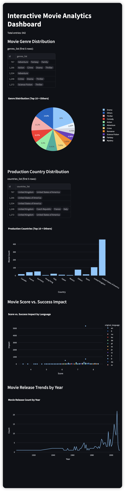

# 🎬 Movie Insight Dashboard

An interactive data analytics dashboard built using Python, Pandas, and Streamlit to uncover insights from large-scale movie datasets. The project enables users to explore trends in genres, production volume, ratings, and success metrics.

## 🔧 Tech Stack
- Python, Pandas, Plotly, Streamlit
- Dataset: movies.csv, processed analytics files

## 📊 Features
- Genre distribution pie chart
- Country vs. rating scatter plot
- Impact vs. rating heatmap
- Yearly production trends
- Interactive UI with filtering and search

## 🚀 How to Run
```bash
pip install -r requirements.txt
cd app
streamlit run app.py
```

## 📁 Project Structure
- `data/` - Source & processed movie data
- `screenshots/` - UI and visual output samples
- `app/` - Main Streamlit app
- `notebook/` - Supporting scripts and test modules

## 📸 Screenshots

